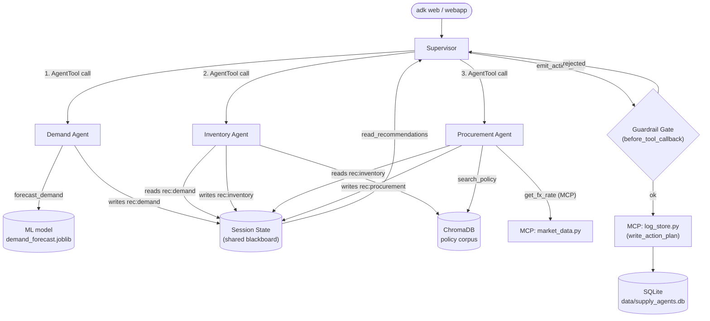

# Supply Chain Multi-Agent System — Project Report

**Scope:** an MVP multi-agent supply-chain planner built on Google ADK
(`docs/feature.prd`), extended with five additive Phase 1 pieces: a
persistent log store via MCP, session persistence, YAML-driven guardrail
templates, a standalone A2A protocol demo, and a trained ML demand-forecast
model. See [README.md](README.md) for setup/usage and [TESTING.md](TESTING.md)
for how to verify each piece; this report covers architecture, design
rationale, limitations, and next steps.

---

## 1. General Architecture

### 1.1 Core pipeline

A **supervisor** agent coordinates three **specialist** agents — demand,
inventory, procurement — in a fixed sequence, reconciling their output into
one purchase-order plan:

Key properties:
- **Hub-and-spoke, not peer-to-peer.** Specialists never talk to each
  other; all coordination is via the supervisor's sequential calls plus a
  shared session-state "blackboard" (`rec:demand`, `rec:inventory`,
  `rec:procurement`). Ordering is load-bearing — inventory needs demand's
  forecast, procurement needs inventory's shortfall list.
- **Reconciliation priority** (in the supervisor's instruction): cover the
  identified shortfall first, then minimize cost, then respect
  `budget_per_cycle`.
- **The guardrail gate** sits between the supervisor's candidate plan and
  what actually gets persisted — bad quantities and unavailable suppliers
  are clamped out; an over-budget plan is rejected outright and must be
  revised.
- **Scenarios are static JSON fixtures** (`scenarios/*.json`), loaded via
  `loader.py` — the entire "world" (SKUs, warehouses, suppliers, budget) is
  read fresh from disk, not from a database.

### 1.2 How it works, in plain terms

**The four agents:**

- **Demand agent** — forecasts how much of each SKU will sell soon, and
  flags any that look like a spike. Tools: reads the world snapshot, runs a
  batch demand forecast (backed by the trained ML model, see below), and
  writes its findings to shared state.
- **Inventory agent** — decides which SKU/warehouse combinations are
  running low and need restocking, and by how much. Tools: computes reorder
  points, checks current stock levels, and looks up the stocking policy via
  RAG (see below) to size safety buffers correctly.
- **Procurement agent** — for anything that needs restocking, picks a
  supplier, quantity, and cost. Tools: ranks suppliers by cost/lead-time/
  reliability, looks up policy via RAG, and calls an MCP tool for a live
  exchange rate (see below).
- **Supervisor** — runs the other three in order, reads back everything
  they found, reconciles it into one purchase-order plan (cover the
  shortfall, minimize cost, respect budget), and — once the guardrails
  approve it — logs the plan via another MCP tool.

**RAG** (`kb/`, `rag/`) exists so inventory/procurement ground their
reasoning in *written* company policy (stocking rules, budget discipline,
supplier preference) instead of just guessing plausible-sounding numbers.

**MCP** (`mcp_server/`) exists to demonstrate the agent actually reaching
outside its own process for two things: a live-ish exchange rate
(read-only) and persisting an approved plan to the database (write) — both
go through the Model Context Protocol rather than being plain in-process
function calls, so they behave like calls to a genuinely external system.

**The LLM judge** is a second opinion, not a gate: after a plan is
produced, a separate model call reads the rationale and scores whether it
actually matches what the specialists found and respects the budget. It's
recorded for every run but never blocks anything — it's there to catch
"the reasoning quietly got worse" over time, which the strict pass/fail
checks can't see.

**Session state** is the shared scratchpad the four agents write to and
read from — each specialist's findings land in state under its own key, so
the next agent (and the supervisor) can see them without anyone re-stating
results in a prompt.

**Scenarios** (`scenarios/*.json`) are fixed, fully-known test worlds — not
meant to cover everything, just enough distinct situations (a demand
spike, a supplier outage, a tight budget, a healthy baseline, ...) to prove
the agents make the right call in each recognizably different case.

**Briefly, the other three pieces:**
- **A2A demo** (`a2a_demo/`) — a small, separate demo proving two agents
  can talk to each other over the Agent2Agent protocol. Not connected to
  the main pipeline above.
- **ML forecast model** (`ml/`) — a small trained regression model that
  replaced the demand agent's original hand-written forecasting formula.
- **Observability** (`agents/observability.py`) — tracks token usage and
  estimated cost per model call, and records a full trace of every tool
  call across all four agents for the webapp's UI.

### 1.3 Supporting subsystems

| Subsystem | Role |
|---|---|
| **RAG** (`kb/`, `rag/`) | Policy corpus embedded into ChromaDB; `search_policy` grounds inventory/procurement reasoning in written stocking/budget/supplier policy rather than free-form guessing. |
| **MCP** (`mcp_server/`) | Two local stdio servers: `market_data.py` (`get_fx_rate`, read-only) and `log_store.py` (`write_action_plan`, the only write path to the DB that an LLM decision triggers). |
| **Guardrails** (`guardrails/`) | A generic rule engine (budget cap, supplier availability, quantity range, prompt-injection patterns) driven by `guardrails/templates/default.yaml`; `agents/guardrails.py` is a thin ADK-callback wrapper over it. |
| **ML** (`ml/`) | A trained `GradientBoostingRegressor` backing `forecast_demand`, replacing a hand-rolled weighted-average formula. |
| **A2A demo** (`a2a_demo/`) | A standalone, decoupled demonstration of the Agent2Agent protocol — a peer agent served over HTTP, a caller that reaches it as a remote agent. Not wired into the pipeline above. |
| **Persistence** (`db.py`) | One SQLite file, three tables (`action_plans`, `eval_results`, `run_costs`), plus ADK's own session tables (webapp only, via `DatabaseSessionService`) for conversation persistence across restarts. |
| **Observability** (`agents/observability.py`) | A `TraceCollectorPlugin` capturing the full nested tool-call tree across the supervisor *and* all three specialists (needed because `adk web`'s own event view can't show nested `AgentTool` sub-runs), plus a `TokenUsagePlugin` for per-call token and estimated-cost accounting (see "Cost tracking" below). |
| **Trigger security** (`agents/trigger_guard.py`) | A `before_agent_callback` gate applied by default to every entry point: rejects any invocation whose triggering message isn't an exact match on a fixed, code-constructed instruction, before any model call happens. `strict_trigger=True` is the default on `create_app()` — see §1.4. |
| **Cost tracking** (`agents/pricing.py`) | A hardcoded $/1M-token rate table converts each model call's token usage into an estimated USD cost, aggregated per run (overall and per agent) by `TokenUsagePlugin` and persisted to `run_costs` by the webapp/evals (same opt-in pattern as the trigger gate — see §2). |
| **Transient-error retries** (`agents/model_config.py`) | Every agent's model (and the eval judge's client) carries `google.genai.types.HttpRetryOptions`, the SDK's own HTTP-level retry — applies uniformly to every entry point, including `adk web`, which previously had no retry logic at all. See §2. |

### 1.4 Entry points

- **`adk web .`** — Google's own interactive UI; auto-loads a default
  scenario on first turn. Executes only on an exact match of
  `EXPECTED_TRIGGER_MESSAGE` (`strict_trigger=True`, the default) — a
  greeting or paraphrase is rejected before any model call, same as the
  other two entry points below.
- **Custom FastAPI webapp** (`webapp/`) — purpose-built alternative: browse
  scenarios, trigger a run, see the full nested trace with state-change and
  RAG-usage highlighting, browse run history. The message that starts a run
  is always the same fixed string, never user-typed text.
- **`evals.run_evals`** — CLI eval harness; runs the same pipeline against
  12 curated scenarios and grades the result (see §1.5).
- All three ultimately construct the same `App`
  (`agents/supervisor_agent.py::create_app`), so behavior is fully
  consistent across entry points — `strict_trigger` used to default to
  `False` (open chat for `adk web`, opt-in hardening for the other two);
  it's now `True` everywhere, opt-out rather than opt-in, after live
  testing showed `adk web`'s open chat was itself the injection surface
  worth closing.

### 1.5 Evaluation model

Two independent grading layers, deliberately asymmetric in authority:

- **Layer A (authoritative)** — deterministic, hand-written assertions per
  scenario (e.g. "AC-12's total ordered quantity exceeds N," "the
  unavailable supplier is never used," "total cost stays within budget").
  Gates pass/fail and the harness's exit code.
- **Layer B (directional only)** — an LLM judge scores the supervisor's
  rationale 1-5 on faithfulness, constraint-adherence, and relevance.
  Recorded for every run but **never gates anything** — LLM-graded scores
  are too noisy to safely use as a pass/fail signal.

---

## 2. Design Decisions and Trade-offs Considered

| Decision | Alternative considered | Why this choice |
|---|---|---|
| Plain `sqlite3`, no ORM | SQLAlchemy ORM | Two tables, simple inserts/selects — an ORM is pure overhead at this scale; keeps the project's original "no ORM" principle intact even after reversing "no database." |
| Local SQLite file | External hosted DB (e.g. Supabase) | Single-operator dev/demo tool, no concurrent-writer or remote-access need. An external service adds a secret, a network dependency, and a new failure mode for no offsetting benefit. Not a one-way door — both `db.py` and `DatabaseSessionService` take an arbitrary connection string, so this is a config change later, not a rewrite. |
| MCP only for *agent-initiated* writes | MCP for all DB access, including our own harness/webapp code | MCP overhead is only justified where an LLM is actually making the call/no-call decision. Eval and webapp history reads/writes go straight to `db.py` — no protocol overhead for deterministic code. |
| Guardrail rules as YAML config | Keep rules hardcoded in Python | Config-driven rules let a new check (or a tuned threshold) ship as a one-line YAML edit instead of a code change/redeploy — proved this by adding a new prompt-injection pattern purely via YAML, with a passing test. |
| Derive spike classification from the model's own prediction | The trained model can predict *lower* than the old formula after a spike (it learned demand reverts, doesn't stay elevated) — coupling spike classification to that value risked silently flipping behavior on existing eval cases. Decoupling was the cheaper, lower-risk option; verified zero regressions across all 12 scenarios × every SKU. |
| A2A demo fully decoupled from the supervisor pipeline | Wire a real cross-org lead-time lookup into procurement's flow | The production pipeline already had 12 passing eval cases and a guardrail-gated commit path; a live network call to a second process adds a new failure mode (timeout, malformed response, process not running) for a piece explicitly scoped as "prove the protocol, no domain role." A decoupled demo proves the same mechanics with zero blast radius. |
| Fail-soft tool design | Let validation errors propagate/crash the run | An uncaught `pydantic.ValidationError` once crashed the entire `adk run` process. All `emit_*` tools now catch and return `{"status": "error", ...}`; the ML predictor falls back to the original formula rather than raising if the model file is missing/corrupt. |
| Two-layer, asymmetric eval grading | Single grading mechanism (e.g. LLM-judge only) | Deterministic assertions are reliable enough to gate CI-style pass/fail; LLM judging is valuable as a *quality* signal (rationale clarity, citation of policy) but not reliable enough to gate on without producing flaky failures unrelated to real correctness. |
| Batch tool variants (`forecast_demand_for_all_skus`, etc.) + context caching | Per-SKU tool calls in a loop | Directly reduced token spend and latency; per-SKU looping was identified as a concrete cost problem during development. |
| Trigger validation as a deterministic pre-model gate, default-on everywhere | Prompt-level hardening alone; or keeping the gate opt-in with `adk web` exempt (the initial design) | This POC simulates a production shape where a worker (not a human) starts each run with one fixed instruction — so the gate can reject non-conforming input *before* any LLM call, strictly stronger than prompt-level defense alone. Initially shipped opt-in (`strict_trigger=True` for webapp/evals, off for `adk web`, to preserve it as an open dev tool) — reversed to default-on everywhere after live testing showed `adk web`'s open chat was itself exactly the injection surface being defended against; `strict_trigger=False` remains available as an explicit opt-out for anyone who deliberately wants an open chat for debugging. |
| `SPECIALIST_MODEL` bumped from `flash-lite` to full `flash` | Keep the cheaper model | `flash-lite` intermittently returned empty (zero-token) responses after large tool results in testing — a reliability regression that outweighed the cost savings. |
| Cost as a new `run_costs` table, not a column on `action_plans` | Add a `cost_usd` column to `action_plans` | `action_plans` rows are written by the supervisor's own MCP tool call, mid-run, before total cost across the whole invocation is known — retrofitting a value there would need a fragile follow-up UPDATE. A separate table, written directly by the same deterministic caller that already writes `eval_results`, avoids that entirely and mirrors the existing "our own code writes directly, no MCP round-trip for non-agent-decisions" principle. |
| Hardcoded cost-estimate rate table, clearly labeled as an estimate | Skip cost tracking until real billing data is available | Directionally useful today (which agent/scenario is expensive) outweighs the risk of an approximate number, as long as it's never presented as an actual bill — every surface it appears on (console, DB, UI) says "estimated." |
| SDK-native `HttpRetryOptions` for transient-error retry | A custom ADK `on_model_error_callback` plugin (the initial plan) | The plugin approach was proposed first and would have worked (ADK does expose that hook), but checking the installed `google-genai` SDK found it already has its own HTTP-level retry mechanism, configured directly on the model/client rather than wrapped around a `Runner`. That means it applies to `adk web` automatically (a plugin registered only in `create_app()` would not have), and its default retryable-status-code set already excludes non-retryable 4xx errors — a custom plugin would have had to reimplement both of those correctly. Simpler and more correct than the original proposal. |

---

## 3. Limitations Encountered

- **LLM reliability is the largest recurring source of failure.** Empty or
  zero-token responses (traced at different points to vague tool schemas,
  then to model-tier reliability specifically under large tool payloads),
  transient `503` "overloaded" errors, and `429` quota errors all occurred
  during development and testing. Retry-with-backoff, stricter schemas, and
  a model-tier bump reduced but did not eliminate this — a live eval re-run
  during final testing still hit a fully empty `ActionPlan` (the supervisor
  simply never completed its final turn), which passed cleanly on retry.
  **This means any single run can fail for reasons unrelated to the code.**
  `agents/model_config.py`'s SDK-level retry (added after this was written)
  now handles the `503`/`429` case automatically at the HTTP layer,
  everywhere including `adk web` — but a fully empty response with no
  error raised at all (the `ActionPlan` case above) is a different failure
  mode entirely and isn't something any retry mechanism can detect on its
  own, since nothing actually errors.
- **`adk web`'s built-in trace view cannot show nested `AgentTool`
  sub-runs** — a real blind spot that made early multi-agent coordination
  bugs (e.g. procurement over-ordering because it lacked a tool to read
  inventory's recommendation) hard to diagnose until a custom trace
  collector/webapp was built.
- **The LLM-judge (Layer B) is inherently noisy** by construction — this is
  a designed-around limitation (hence non-gating), not a bug, but it means
  Layer B scores should never be read as a hard quality metric.
- **ML model quality is bounded by synthetic training data** — no real
  historical sales data was available, so the regression model's realism is
  only as good as the synthetic generator's assumptions (baseline level +
  gaussian noise + injected spikes + mild seasonality). It sometimes
  predicts counter-intuitively (mean-reversion right after a spike), which
  was only safe here because spike classification was deliberately kept
  independent of the model's output.
- **`google-adk[a2a]` and related ML/DB extras are explicitly experimental**
  — `to_a2a`/`RemoteA2aAgent` emit `[EXPERIMENTAL]` warnings; the API
  surface could change in a future ADK release without notice.
- **No production-readiness work was in scope** — no authentication on the
  webapp or MCP servers, no deployment/scaling story, everything assumes a
  single local operator on `localhost`. Deliberate scope boundary for a
  learning project, not an oversight, but worth stating plainly for anyone
  evaluating this as a production candidate.
- **The trigger-security gate only covers the message that starts a run** —
  it doesn't (and structurally can't) prevent every injection vector; tool
  output and scenario content are separately sanitized, but a genuinely
  new untrusted data source added later would need to be wired into the
  same sanitization pass explicitly, it isn't automatic. It's now applied
  by default everywhere, including `adk web` (see §1.4) — but this also
  means `adk web`'s original role as an unrestricted interactive chat is
  gone by default; anyone who wants that back needs `strict_trigger=False`
  explicitly.
- **No fully offline evaluation path** — `evals.run_evals` and any live
  scenario run require real, paid Gemini API calls; there's no
  mocked/offline mode, so verifying agent *behavior* (as opposed to pure
  unit tests) always costs time and money and can't run in an
  API-key-less CI environment as currently built.
- **The cost metric is a best-effort estimate, not a real bill.** The rate
  table in `agents/pricing.py` (checked against Google's rate card,
  2026-07) reflects paid-tier, text/image/video, per-token rates only — it
  doesn't account for free-tier allowances, audio pricing, batch discounts,
  or future price changes; an unrecognized model id silently falls back to
  another model's rates rather than raising. It also excludes Gemini's
  separate ~$1.00/1M-tokens/hour context-cache **storage** fee (distinct
  from the discounted per-token *read* rate, which is modeled) — per-call
  usage metadata doesn't expose how long content stayed cached, so that
  cost dimension isn't tracked at all. Useful for relative comparison
  (which agent/scenario costs more) but not for exact budgeting. `adk web`
  runs aren't tracked in `run_costs` at all (see §1.4) — only webapp/eval
  runs are.
- **Scenario switching mid-session isn't supported** — a session loads one
  scenario on its first turn and that's fixed for the session's lifetime;
  testing a different scenario means starting a new session.

---

## 4. Proposed Future Work

Roughly in order of how directly they build on what already exists:

1. **Wire A2A into the real pipeline, deliberately, as its own decision.**
   The current demo proves the protocol works; actually having
   `procurement_agent` consult a partner-org peer (e.g. a live lead-time
   check) before finalizing a plan is a natural next step — but it should
   be scoped and tested with the same rigor as the other Phase 1 pieces,
   not folded in casually given the new failure modes a live network call
   introduces.
2. **Session-history browsing UI.** Session persistence already stores full
   conversation/event history durably across restarts; there's currently no
   UI to browse past sessions, only the ability for a session to resume.
3. **Multi-cycle / complex planning flows.** The current system plans one
   cycle from a static snapshot; a natural extension is multi-period
   planning (e.g. this cycle's orders affecting next cycle's starting
   inventory), which was explicitly flagged as out-of-scope/deferred during
   initial Phase 1 planning given its size.
4. **Real historical data for the ML model.** Retraining (or fine-tuning)
   `ml/train_demand_model.py` against real sales history instead of
   synthetic-only data, once such data exists, would meaningfully improve
   forecast realism beyond what the synthetic generator's assumptions allow.
5. **Multiple guardrail templates, selectable per scenario/agent.** The
   `GuardrailTemplate` schema already carries a `name` field for this; no
   selection mechanism exists yet — everything currently runs on one
   `default.yaml`.
6. **Additional guardrail categories** (rate limiting, PII detection) —
   explicitly out of scope for the templating piece, which only
   generalized what already existed rather than adding new checks.
7. **Extend the trigger-security model beyond an exact-match gate.** If a
   real deployment ever needs *structured* input (e.g. "run for warehouse
   X only"), the gate would need to validate against a schema/allowlist
   rather than one fixed string — the current design deliberately covers
   only the "one worker, one job" shape described for this POC, not a
   general input-validation framework.
8. **Live-streaming trace in the webapp.** Runs are currently synchronous
   (the page waits ~1-2 minutes); SSE/WebSocket streaming would improve the
   interactive experience without changing the underlying pipeline.
9. **Aggregate eval/judge reporting.** Layer A/B results are persisted per
   run but never aggregated — a dashboard or trend view across runs (e.g.
   "has rationale quality drifted over the last N runs?") would make the
   judge's data actually actionable instead of only inspectable per-row.
10. **Differentiated model tiers / thinking-budget caps.** Raised and
    explicitly deferred earlier in the project as a cost-optimization
    lever; worth revisiting once the system's behavior is stable enough to
    isolate a model-swap's effect cleanly.
11. **Production hardening**, if this ever needs to run beyond a local
    demo: authentication on the webapp/MCP servers, a real deployment
    target, and a non-paid/offline evaluation path for CI.
12. **Reconcile the cost estimate against real billing.** `run_costs` is
    currently an independent estimate; cross-checking it against actual
    Google Cloud billing export data (once on a paid tier with real spend)
    would validate the rate table and surface where the estimate is off
    (free-tier usage, batch pricing, etc.) rather than trusting it blind.
